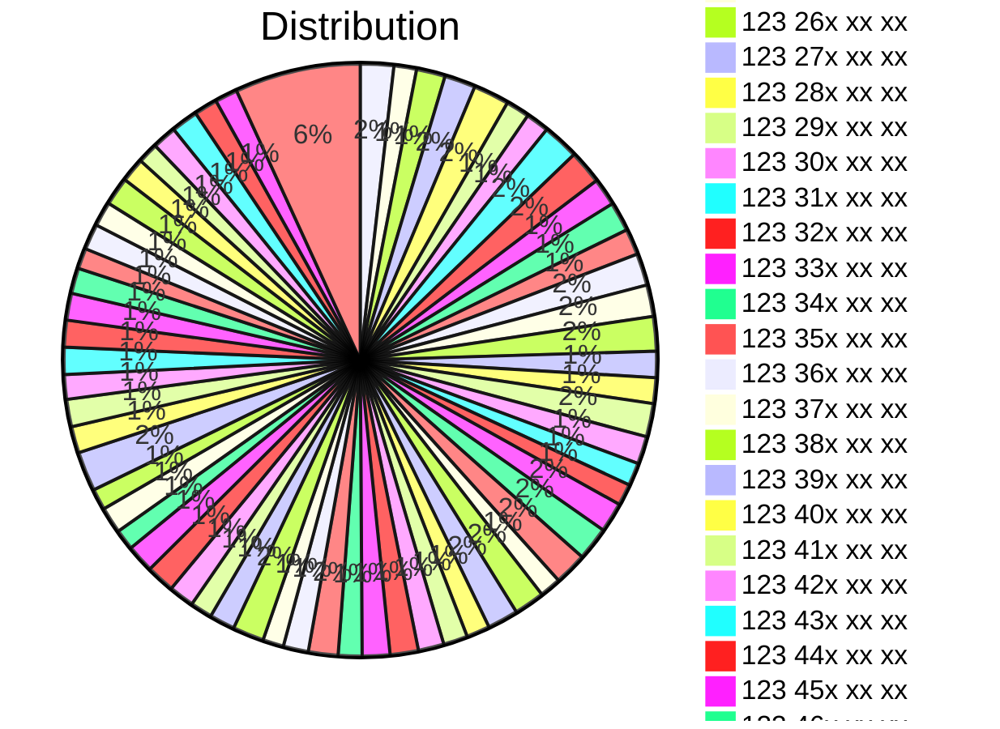

# Swish 123

*(This concerns Swedes and people living in Sweden, hence written in Swedish)*

Detta är ett försök att skapa en datakälla med alla kända och okända Swish 123-nummer, enligt Swish använder [319412](https://www.swish.nu/about-swish#Swish_in_numbers) företag/organisationer Swish-platformen för betalningar. Det vore därför trevligt att kunna bygga API eller bara kunna kolla vem/vilka som har ett Swish 123-nummer.

Detta lilla projekt drivs på fritiden av en privatperson och på hobby-basis.

Önskar du tillägg eller förändringar, skapa en PR så infogas detta "ASAP" (när jag har tid) - var vänlig gör endast en förändring per PR för att göra det överskådligt och enkelt för mig att verifiera förändringar.

[Aktuell lista med Swish 123-nummer](https://github.com/cisene/swish-123/blob/master/swish-123.md) (Eye-candy)

[JSON](https://github.com/cisene/swish-123/blob/master/json/swish-123-datasource.json)

[TSV](https://github.com/cisene/swish-123/blob/master/text/swish-123-datasource.tsv)

[CSV](https://github.com/cisene/swish-123/blob/master/text/swish-123-datasource.csv)

[XML](https://github.com/cisene/swish-123/blob/master/xml-data/swish-123-datasource.xml)

## Samlade nummer

I aktuell samling av Swish-nummer har vi ***6945*** verifierade nummer. Dessa utgör bara en del av den fulla mängden existerande Swish-nummer, vi samlar och verifierar hela tiden nya och lägger dessa till samlingarna.

## Distribution av Swish-nummer

## Användning av information från Swish 123

Användning av [Swish 123](https://github.com/cisene/swish-123) data kan skådas på bland annat [Swish-Katalogen](https://b19.se/swish-katalogen/) där dessa data exponeras i en enkel söktjänst genom tagg-moln och fritext sökning.

## Vad är ett Swish 123-nummer?

Swish 123-nummer är 10-ställiga nummer som har begynnelsesiffror "123". Detta ger en nummer-rymd om 9999999, nära 10 miljoner nummer. Bland dessa nummer finns serier allokerade för specifika ändamål. 

Listan innehåller Swish 123-nummer som samlats och kunnat knytas till en organisation med organisationsnummer - i de fall 123-nummret innehas av enskild företagare to utelämnas detta eftersom det då skulle utgöra problem med GDPR på grund av företagarens personnummer.

## Swish 1239XX

Speciella serier av 1239XX (900-909) är allokerade till organisationer med så kallade 90-konton genom [Insammlingskontroll](https://www.insamlingskontroll.se/90-konto-organisationer/). För tillfället är 445 organisationer under kontroll.

Några populära exempel:

* Radio Hjälpen, pg 90 1950-6, med Swish nummer **[1239019506](https://b19.se/swish-katalogen/1239019506)** ibland uttryckt som 901 95 06
* Läkare Utan Gränser, pg 90 0603-2, med Swish nummer **[1239006032](https://b19.se/swish-katalogen/1239006032)** ibland uttryckt som 900 60 32
* Human Rights Watch Scandinavia, pg 90 0454-0, med Swish nummer **[1239004540](https://b19.se/swish-katalogen/1239004540)** ibland uttryckt som 900 45 40

Dessa kan även hittas i Swish-Katalogen under kategorin [insamlingskontroll](https://b19.se/swish-katalogen/k/insamlingskontroll).

## Varför?

Initiativet startades medan huvudet var fullt med snor och lätt febrig, 2021-12-30 12:30 ungefär efter att ha letat på nätet efter Swish nummer att skicka betalning till. Detta skulle kunna användas som data-källa för ett eventuellt API eller som katalog att inkludera i en App. [Swish](https://swish.nu/) själva verkar inte exponera eller tillhandahålla dessa nummer själva. 

### TODO:

* Skapa script för QA-kontroller av information (saknade eller felaktigt formatterade uppgifter)

### Support/Stöd

Att bidra till projektet uppskattas, det betalar lite av kostnaderna att hålla servrar igång, domännamn och annat.

Några som bidragit är:
* Maria B
